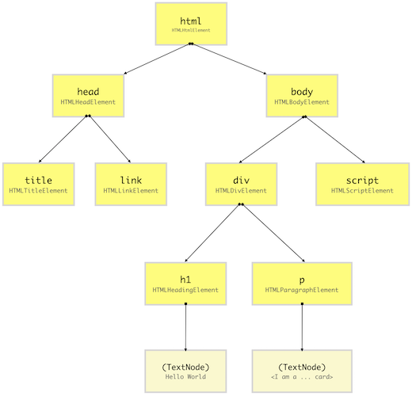

# How Browser Renders a Webpage

- A browser is a software application used to locate, retrieve and display content on the World Wide Web, including Web pages, images, video and other files. As a client/server model, the browser is the client run on a computer that contacts the Web server and requests information. The Web server sends the information back to the Web browser which displays the results on the computer or other Internet-enabled device that supports a browser.
- The main function of a browser is to present the web resource you choose, by requesting it from the server and displaying it in the browser window. The resource is usually an HTML document, but may also be a PDF, image, or some other type of content. The location of the resource is specified by the user using a URI (Uniform Resource Identifier).
- The way the browser interprets and displays HTML files is specified in the HTML and CSS specifications. These specifications are maintained by the W3C (World Wide Web Consortium) organization, which is the standards organization for the web.

## High Level Components of a browser

### 1. User Interface:

- The user interface is the space where User interacts with the browser. It includes the address bar, back and next buttons, home button, refresh and stop, bookmark option, etc. Every other part, except the window where requested web page is displayed, comes under it.

### 2. Browser Engine:

- The browser engine works as a bridge between the User interface and the rendering engine. According to the inputs from various user interfaces, it queries and manipulates the rendering engine

### 3. Rendering Engine:

- The rendering engine, as the name suggests is responsible for rendering the requested web page on the browser screen. The rendering engine interprets the HTML, XML documents and images that are formatted using CSS and generates the layout that is displayed in the User Interface. However, using plugins or extensions, it can display other types data also. Different browsers user different rendering engines:
- Internet Explorer: Trident
- Firefox & other Mozilla browsers: Gecko
- Chrome & Opera 15+: Blink
-  Chrome (iPhone) & Safari: Webkit

### 4. Networking:

- Component of the browser which retrieves the URLs using the common internet protocols of HTTP or FTP. The networking component handles all aspects of Internet communication and security. The network component may implement a cache of retrieved documents in order to reduce network traffic.

### 5. JavaScript Interpreter:

- It is the component of the browser which interprets and executes the javascript code embedded in a website. The interpreted results are sent to the rendering engine for display. If the script is external then first the resource is fetched from the network. Parser keeps on hold until the script is executed.

### 6. UI Backend:

- UI backend is used for drawing basic widgets like combo boxes and windows. This backend exposes a generic interface that is not platform specific. It underneath uses operating system user interface methods.

### 7. Data Persistence/Storage:

- This is a persistence layer. Browsers support storage mechanisms such as localStorage, IndexedDB, WebSQL and FileSystem. It is a small database created on the local drive of the computer where the browser is installed. It manages user data such as cache, cookies, bookmarks and preferences.

## Rendering engine and its use.

- The primary function of a browser rendering engine is to visualize the content requested by users in an interactive view. For instance, if a user requests an HTML script content, the rendering engine’s job is to parse the CSS and HTML. Henceforth, the content is displayed after being parsed through a rendering engine. The scalable dimension-based format ensures a rendered display significantly restoring an original page layout interpreted from its original form, while indulging scaling and panning features of the web content in real-time environment. The interaction between the end-user through an interface & the rendering engine is facilitated by the browser engines. It facilitates with a high-level interface between the User Interface and Rendering engine.

- A network layer tenders the browser rendering engine with the requested document by the user. The contents available in such document is then transferred in parts of sizes of 8 kilobyte each. In this order, the below points are furthered to accomplish this process as mentioned below :
The rendering engine will start parsing the HTML document and convert elements to DOM nodes in a tree called the "content tree". The engine will parse the style data, both in external CSS files and in style elements. Styling information together with visual instructions in the HTML will be used to create another tree: the render tree.
- The render tree contains rectangles with visual attributes like color and dimensions. The rectangles are in the right order to be displayed on the screen.
After the construction of the render tree it goes through a "layout" process. This means giving each node the exact coordinates where it should appear on the screen. The next stage is painting–the render tree will be traversed and each node will be painted using the UI backend layer.
- It's important to understand that this is a gradual process. For better user experience, the rendering engine will try to display contents on the screen as soon as possible. It will not wait until all HTML is parsed before starting to build and layout the render tree. Parts of the content will be parsed and displayed, while the process continues with the rest of the contents that keeps coming from the network.

## Parsers (HTML, CSS, etc)
- There are two types of parsers: top down parsers and bottom up parsers. An intuitive explanation is that top down parsers examine the high level structure of the syntax and try to find a rule match. Bottom up parsers start with the input and gradually transform it into the syntax rules, starting from the low level rules until high level rules are met.
- The word parsing means to divide something into its components and then describe their syntactic roles. The word processing is a familiar word and stands for dealing with something using a standard procedure. Combined these two explain how HTML parser works in generating DOM trees from text/html resources.

- parsing is nothing but processing of the code written by developer to visual format. parsing of the html and Css means that how the browser will process them and how it will arrange our code in the visual format  on the browser screen.
- When the user requested the website then the browser will request the HTML document from the server and the browser will load up the code in the HTML document.
- This approach defines the parsing rules for HTML documents for determining whether they are syntactically correct or not. The points where the syntax fails to match, a parse error is initiated. At the end of the procedure if a resource is determined to be in the HTML syntax, then it is an HTML document.
- The input to the HTML parsing process consists of a stream of code points, which are then passed through a tokenization stage followed by a tree construction stage to produce a Document object as an output. Mostly, the data handled by the tokenization stage comes from the network, but it can also come from a script running in the user agent, e.g. using the document.write() API. The tokenizer and the tree construction stage have only one set of states, but while the tree construction stage is working with one token, the tokenizer can be resumed. Because of this tree construction stage is often considered reentrant. To handle such cases, parsers have a script nesting level, which must initially be set to 0 and a parser pause flag, which must be initialized to false.

## Document Object Model (DOM)
- When the browser reads HTML code, whenever it encounters an HTML element like html, body, div etc., it creates a JavaScript object called a Node. Eventually, all HTML elements will be converted to JavaScript objects.
- Since every HTML element has different properties, the Node object will be created from different classes (constructor functions). For example, the Node object for the div element is created from HTMLDivElement which inherits Node class.
- The browser comes with built-in classes like HTMLDivElement, HTMLScriptElement, Node etc.
After the browser has created Nodes from the HTML document, it has to create a tree-like structure of these node objects. Since our HTML elements in the HTML file are nested inside each other, the browser needs to replicate that but using Node objects it has previously created. This will help the browser efficiently render and manage the webpage throughout its lifecycle.

 
- JavaScript doesn’t understand what DOM is, it is not part of the JavaScript specifications. DOM is a high-level Web API provided by the browser to efficiently render a webpage and expose it publically for the developer to dynamically manipulate DOM elements for various purposes.

## CSS Object Model (CSSOM)
- After constructing the DOM, the browser reads CSS from all the sources (external, embedded, inline, user-agent, etc.) and construct a CSSOM. CSSOM stands for CSS Object Model which is a Tree Like structure just like DOM.

- Each node in this tree contains CSS style information that will be applied to DOM elements that it target (specified by the selector). CSSOM, however, does not contain DOM elements which can’t be printed on the screen.

 
## Render Tree

- Render-Tree is also a tree-like structure constructed by combining DOM and CSSOM trees together. The browser has to calculate the layout of each visible element and paint them on the screen, for that browser uses this Render-Tree. Hence, unless Render-Tree isn’t constructed, nothing is going to get printed on the screen which is why we need both DOM and CSSOM trees.
- As Render-Tree is a low-level representation of what will eventually get printed on the screen, it won’t contain nodes that do not hold any area in the pixel matrix. For example, display:none; elements have dimensions of 0px X 0px, hence they won’t be present in Render-Tree.

 
## Rendering Sequence

- When a web page is loaded, the browser first reads the HTML text and constructs DOM Tree from it. Then it processes the CSS whether that is inline, embedded, or external CSS and constructs the CSSOM Tree from it.
- After these trees are constructed, then it constructs the Render-Tree from it. Once the Render-Tree is constructed, then the browser starts the printing individual elements on the screen.

## Layout operation
- The first browser creates the layout of each individual Render-Tree node. The layout consists of the size of each node in pixels and where (position) it will be printed on the screen. This process is called layout since the browser is calculating the layout information of each node.
- his process is also called reflow or browser reflow and it can also occur when you scroll, resize the window or manipulate DOM elements. Here is a list of events that can trigger the layout/reflow of the elements.

## Paint operation

- Until now we have a list of geometries that need to be printed on the screen. Since elements (or a sub-tree) in the Render-Tree can overlap each other and they can have CSS properties that make them frequently change the look, position, or geometry (such as animations), the browser creates a layer for it.
- Creating layers helps the browser efficiently perform painting operations throughout the lifecycle of a web page such as while scrolling or resizing the browser window. Having layers also help the browser correctly draw elements in the stacking order (along the z-axis) as they were intended by the developer.
- Now that we have layers, we can combine them and draw them on the screen. But the browser does not draw all the layers in a single go. Each layer is drawn separately first.
- Inside each layer, the browser fills the individual pixels for whatever visible property the element has such as border, background color, shadow, text, etc. This process is also called as rasterization. To increase performance, the browser may use different threads to perform rasterization.
- The analogy of layers in Photoshop can be applied to how the browser renders a web page as well. You can visualize different layers on a web page from Chrome DevTools. Open DevTools and from more tools options, select Layers. You can also visualize layer borders from the Rendering panel.

