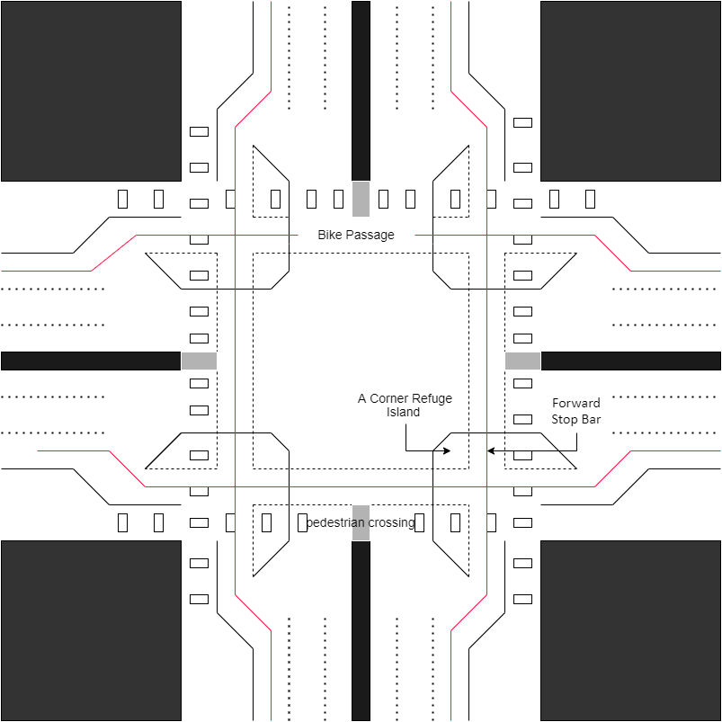

## First Design
- Department of Road safety, Chicago designed a road intersection. 
- Here in this intersection two perpendicular roads meet. Both roads have three lanes of traffic traveling in opposite directions. The intersection meet minimum federal and state safety standards for vehicular and pedestrian traffic. 
 

- But there is no passage for bikers and pedestrian crossing passage is not safe enough for this big intersection. This solution does not capture the reality in it’s entirely so our department designed a new solution to accommodate the needs of people like bike passage and safe pedestrian passage.

## Solution:
### Top view design

 
- Department designed a new solution to accommodate the bike passage and pedestrian passage for people to move safely on roads.
-The red line shows the bike passage in which only bikes are allowed to use the passage. Other vehicle and pedestrians are not allowed to use this passage only they can cross through passage.
- White boxes shows the pedestrian passage. It is specific to pedestrians only. Other vehicle can only cross through the passage. Pedestrians can use grey box space in passage to take a stop before crossing the road. Pedestrians no longer need to cross the road at one go they can stop at the Grey space in passage. This takes into consideration for elderly people and persons with disabilities who cannot cross road in one go.

## Key improvements:
### 1.	Pedestrians Passage
- At intersection, we decreased the length of the pedestrian passage. Earlier to go to other side of road, pedestrians need to cross 3 + 3 = 6 lanes but in the new design we block the space of biker lane so pedestrian have to cross only 2 + 2 = 4 lanes to go to  other side of road.
- Pedestrian refuge islands (grey boxes) are defined as the areas within an intersection or between lanes of traffic where pedestrians may safely wait until vehicular traffic clears, allowing them to cross a street. These islands provide a resting area for pedestrians, particularly those who are wheelchair-bound, elderly, or otherwise unable to completely cross an intersection within the provided signal time. These refuge islands also provide a safety area for pedestrians caught in the street when a signal changes
- Took vertical as well as horizontal sight distances into account.
- Prohibited parking near intersections. 
- Limited right-turn-on-red movements in areas of high pedestrian volumes. 
-  Kept crosswalks at right angles to turning roadway terminals and slip lanes. 
- Kept right turns below 15 mph and left turns below 20 mph. 
- Located crossing close to the parallel street. 
- Placed crosswalks across the full width of the pavement. 
- Used crosswalks at all signalized intersections. 
- Used crosswalks at non-signalized intersections with discretion. 
- Used special markings such as striped (“zebra”) longitudinal lines or diagonal cross     hatching for added visibility and to emphasize a crossing. 

### 2.	Bike passage :

- This design include the left lanes dedicated for bike use only. Bikers are not allowed to cross through the centre of intersection. The separate passage is provided for them to cross the road indicated by red line. All the bikes traffic will move through red line passage. This will help to reduce conflicts of bikes with other types of vehicles.

- We know that protected bike lanes are the key to getting the average person to consider traveling by bike. Sharing busy traffic lanes with cars is absolutely un-acceptable, and separation by a line of paint is often not enough. 

#### There are four main elements to protected intersection designs: 
1. Corner Refuge Island 

2. Forward Stop Bar for Biker

3. Setback bike and pedestrian crossing 

4. Biker Friendly Signal phasing 

#### The Corner Refuge Island 
- The corner refuge island is the key element that makes these intersections function. This island brings the protective barrier from the bike lane far into the intersection. 
- The island physically separates bikers as they make right turns, and provide a secure refuge for those waiting at a red signal protected from moving cars. 

#### The Forward Stop Bar 
- Paired with the corner refuge island is a forward stop bar for bikers. While people driving must stop back behind the crosswalk, people on bikes may yield to pedestrians, and stop at a bicycle waiting area farther ahead in the intersection. Bikers turning left also use this space to wait when making a left turn. 
#### The advantage of this design is three fold: 
- The forward stop location makes bikers incredibly visible to drivers waiting at a red light. 
The physical distance ahead of cars gives bicyclist an effective head start when the light turns green. 
- The distance of the road that bikers need to cross is greatly reduced. 
#### The Setback Crossing in Protected Intersections 
- The bike lane bends away from the intersection creating in a setback bikes and pedestrian crossing. 
- In contrast to conventional bicycle crossing that run next to moving cars, the setback crossings provide the space and time for everyone to react to potential conflicts.
- With this design, drivers turn 90 degrees to face the bike lane before they even cross it, making people on bikes highly visible and out of the driver’s blind spot. To allow for adequate reaction time for all users, a small effective corner radius is ued to encourage a slow driver turning speed of 5-10 mph.
#### Bikes-Friendly Signal Phasing 
- This will use of signals to control how and when different people can proceed. At its most secure, a protected signal phase for bikes will use red signals to prevent any conflicting car turning movements. 
- There is no risk of right or left hooks from cars when they are prohibited from turning while bikers are traveling through.
- A variation of the protected signal phase is to give all car movements the red signal, and all bicyclist movements a green. 
- This simultaneous green phase gives full rein of the intersection to bikers, allowing through movements in all directions at once, left turns in one stage and even full U-turns through the intersection. 
- Even at high-volumes, bikers are good at negotiating shared space and will have no trouble staying out of each other’s way.
